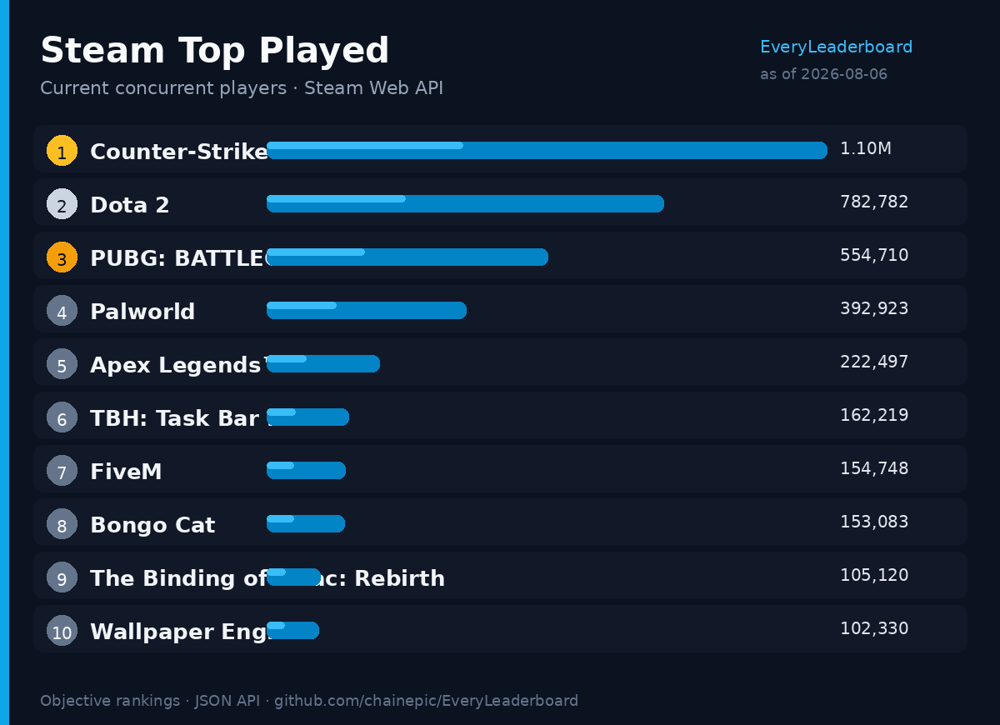
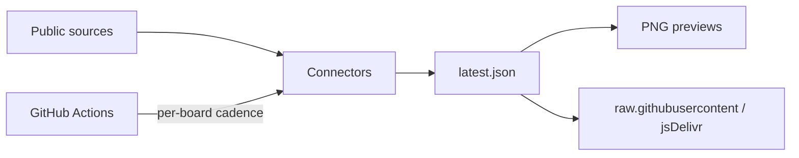

<div align="center">


# EveryLeaderboard

**Open catalog of objective, quantifiable leaderboards.**

[English](README.md) · [简体中文](README.zh-CN.md)

[](LICENSE)
[](catalogs/index.json)
[](schemas/)
[](https://github.com/chainepic/EveryLeaderboard/stargazers)

<br/>


</div>

---

> [!IMPORTANT]
> Measurable rankings with cited sources only — **not** editorial tier lists or subjective S/A/B opinions.

## Preview

Live board rendered from JSON → shareable PNG (auto-refreshed by Actions when snapshots update):

<div align="center">
  
  <p><sub>Crypto Market Cap Top 10 · generated from <code>boards/crypto-marketcap-top100/latest.json</code></sub></p>
</div>

<div align="center">
  
  <p><sub>Steam Top Played · from <code>boards/steam-top-played/latest.json</code></sub></p>
</div>


Regenerate locally:

```bash
python scripts/render_preview.py
```

## Why

Rankings are often locked in paywalled PDFs or messy blog HTML. This repo turns stable public sources into:

| Deliverable | Path |
| --- | --- |
| Browsable catalog | [`catalogs/index.json`](catalogs/index.json) |
| Call-ready snapshots | `boards/{slug}/latest.json` |
| Diffable history | `boards/{slug}/history/` |
| Shareable previews | [`docs/assets/`](docs/assets/) |

## Features

| | |
| --- | --- |
| 📊 **Objective only** | Numeric metrics with units |
| 🖼️ **Shareable images** | PNG previews rendered from snapshots |
| ⏱️ **Per-board schedules** | Hourly / daily / weekly / monthly / on-release |
| 🔌 **Connectors** | One adapter per source family |
| 🧾 **Provenance** | Sources + methodology in each `meta.json` |
| 🌐 **Zero-server API** | `raw.githubusercontent.com` / jsDelivr |

## API (zero server)

```bash
curl -sL https://raw.githubusercontent.com/chainepic/EveryLeaderboard/main/catalogs/index.json
curl -sL https://raw.githubusercontent.com/chainepic/EveryLeaderboard/main/boards/crypto-marketcap-top100/latest.json
```

CDN:

```text
https://cdn.jsdelivr.net/gh/chainepic/EveryLeaderboard@main/boards/{slug}/latest.json
```

## Board catalog

| Board | Slug | Cadence | Status | Metric |
| --- | --- | --- | --- | --- |
| [US Weekend Box Office](boards/box-office-weekend-us/meta.json) | `box-office-weekend-us` | weekly | experimental ✅ | Weekend gross |
| [Chess.com Live Blitz Leaderboard](boards/chess-com-blitz/meta.json) | `chess-com-blitz` | daily | experimental ✅ | Rating |
| [Chess.com Live Rapid Leaderboard](boards/chess-com-rapid/meta.json) | `chess-com-rapid` | daily | experimental ✅ | Rating |
| [China NEV Brand Monthly Sales](boards/china-nev-brand-sales/meta.json) | `china-nev-brand-sales` | monthly | experimental ✅ | Units sold |
| [China Passenger Car Model Monthly Sales](boards/china-passenger-car-sales/meta.json) | `china-passenger-car-sales` | monthly | experimental ✅ | Units sold |
| [Crypto Market Cap Top 100](boards/crypto-marketcap-top100/meta.json) | `crypto-marketcap-top100` | every 6h | experimental ✅ | Market cap |
| [DeFiLlama Protocol TVL Top](boards/defillama-tvl-top/meta.json) | `defillama-tvl-top` | every 6h | experimental ✅ | TVL |
| [GitHub Repositories by Stars](boards/github-repos-stars/meta.json) | `github-repos-stars` | daily | experimental ✅ | Stars |
| [GitHub Daily Star Net Growth](boards/github-star-delta-daily/meta.json) | `github-star-delta-daily` | daily | experimental ✅ | Net star growth |
| [GitHub Trending (Daily)](boards/github-trending-daily/meta.json) | `github-trending-daily` | daily | experimental ✅ | Stars gained (period) |
| [GitHub Trending (Monthly)](boards/github-trending-monthly/meta.json) | `github-trending-monthly` | weekly | experimental ✅ | Stars gained (period) |
| [GitHub Trending (Weekly)](boards/github-trending-weekly/meta.json) | `github-trending-weekly` | weekly | experimental ✅ | Stars gained (period) |
| [GitHub Users by Followers](boards/github-users-followers/meta.json) | `github-users-followers` | daily | experimental ✅ | Followers |
| [Hugging Face Models Trending](boards/hf-models-trending/meta.json) | `hf-models-trending` | daily | planned | Downloads |
| [IMDb Top 250 Movies](boards/imdb-top250/meta.json) | `imdb-top250` | weekly | planned | IMDb rating |
| [NBA Conference Standings](boards/nba-standings/meta.json) | `nba-standings` | daily* | experimental ✅ | Win percentage |
| [npm React Ecosystem Weekly Downloads](boards/npm-react-ecosystem/meta.json) | `npm-react-ecosystem` | weekly | planned | Downloads (7d) |
| [PyPI Tracked Packages Downloads](boards/pypi-top-tracked/meta.json) | `pypi-top-tracked` | weekly | planned | Downloads (30d) |
| [Premier League Table](boards/soccer-pl-table/meta.json) | `soccer-pl-table` | daily* | experimental ✅ | Points |
| [UEFA Champions League Table](boards/soccer-ucl-table/meta.json) | `soccer-ucl-table` | daily* | experimental ✅ | Points |
| [Steam Top Played (CCU)](boards/steam-top-played/meta.json) | `steam-top-played` | daily | experimental ✅ | Current players |
| [Wikipedia Top Pageviews](boards/wikipedia-pageviews-top/meta.json) | `wikipedia-pageviews-top` | daily | experimental ✅ | Pageviews |

\* Season-aware (`active_months` in meta). ✅ = `latest.json` present.

## Quick start

```bash
git clone https://github.com/chainepic/EveryLeaderboard.git
cd EveryLeaderboard
python3 -m pip install -r requirements.txt

python scripts/validate.py
python scripts/run_due.py --dry-run
python scripts/run_due.py --slug crypto-marketcap-top100 --force
python scripts/render_preview.py
```

## Repository layout

```text
boards/<slug>/latest.json    # data
docs/assets/*.png            # shareable previews
scripts/render_preview.py    # JSON → PNG
scripts/run_due.py           # per-board schedule runner
connectors/                  # source adapters
```



## Contributing

Open an issue with: slug, metric + unit, source URL, cadence.  
Subjective / unauditable lists will be rejected.

See also: [Expansion roadmap](docs/EXPANSION.md) (GitHub-first data sources).

## License

- **Code**: [MIT](LICENSE)
- **Data**: declared per board in `meta.json` — respect upstream terms

---

<div align="center">
<sub>English · <a href="README.zh-CN.md">简体中文</a></sub>
</div>
