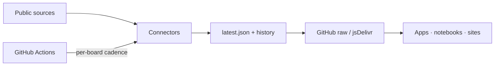

<div align="center">


# EveryLeaderboard

**Open catalog of objective, quantifiable leaderboards.**  
Sales · standings · market caps · downloads — normalized JSON, per-board schedules, free to call.

[](LICENSE)
[](catalogs/index.json)
[](schemas/)
[](#per-board-schedules)
[](https://github.com/chainepic/EveryLeaderboard/stargazers)

[Catalog](#board-catalog) · [API](#api-zero-server) · [Quick start](#quick-start) · [Admission](#admission-rules) · [Contributing](#contributing)

</div>

---

> [!IMPORTANT]
> This project aggregates **measurable rankings with cited sources** — not editorial tier lists or subjective S/A/B opinions.

## Why

Rankings on the web are often trapped in paywalled PDFs or inconsistent blog HTML. EveryLeaderboard turns stable public sources into:

| You get | How |
| --- | --- |
| A browsable **catalog** | [`catalogs/index.json`](catalogs/index.json) |
| Call-ready **snapshots** | `boards/{slug}/latest.json` |
| Diffable **history** | git commits + `boards/{slug}/history/` |
| Honest **cadence** | each board declares its own update schedule |

## Features

| | |
| --- | --- |
| 📊 **Objective only** | Numeric metrics with units (USD, units sold, points, downloads…) |
| ⏱️ **Per-board schedules** | Hourly / daily / weekly / monthly / on-release — not one global cron |
| 🔌 **Connector model** | One adapter per source family under `connectors/` |
| 🧾 **Provenance** | Every snapshot records sources, fetch time, and methodology via `meta.json` |
| 🌐 **Zero-server API** | Consume via `raw.githubusercontent.com` or jsDelivr |
| ✅ **Schema-validated** | JSON Schema for meta, snapshots, and catalog |

## API (zero server)

```bash
# Full catalog
curl -sL https://raw.githubusercontent.com/chainepic/EveryLeaderboard/main/catalogs/index.json

# Latest snapshot
curl -sL https://raw.githubusercontent.com/chainepic/EveryLeaderboard/main/boards/crypto-marketcap-top100/latest.json

# Historical day (when archived)
curl -sL https://raw.githubusercontent.com/chainepic/EveryLeaderboard/main/boards/crypto-marketcap-top100/history/2026-08-06.json
```

CDN mirror:

```text
https://cdn.jsdelivr.net/gh/chainepic/EveryLeaderboard@main/boards/{slug}/latest.json
```

<details>
<summary><strong>Snapshot shape (abridged)</strong></summary>

```json
{
  "schema_version": "1.0.0",
  "slug": "crypto-marketcap-top100",
  "generated_at": "2026-08-06T04:08:20Z",
  "as_of": "2026-08-06T04:08:20Z",
  "period": { "label": "live" },
  "metric": { "id": "market_cap_usd", "unit": "USD" },
  "items": [
    { "rank": 1, "id": "bitcoin", "name": "Bitcoin", "value": 1293260115894.0 }
  ],
  "source_fetched": [
    { "name": "CoinGecko", "url": "https://api.coingecko.com/...", "fetched_at": "..." }
  ]
}
```

</details>

## Board catalog

| Board | Cadence | Status | Metric |
| --- | --- | --- | --- |
| [crypto-marketcap-top100](boards/crypto-marketcap-top100/meta.json) | every 6h | experimental | market_cap_usd |
| [nba-standings](boards/nba-standings/meta.json) | daily* | planned | win_pct |
| [soccer-pl-table](boards/soccer-pl-table/meta.json) | daily* | planned | points |
| [soccer-ucl-table](boards/soccer-ucl-table/meta.json) | daily* | planned | points |
| [steam-top-played](boards/steam-top-played/meta.json) | daily | planned | ccu |
| [github-trending-daily](boards/github-trending-daily/meta.json) | daily | planned | stars_period |
| [github-trending-weekly](boards/github-trending-weekly/meta.json) | weekly | planned | stars_period |
| [hf-models-trending](boards/hf-models-trending/meta.json) | daily | planned | downloads |
| [npm-react-ecosystem](boards/npm-react-ecosystem/meta.json) | weekly | planned | downloads_week |
| [pypi-top-tracked](boards/pypi-top-tracked/meta.json) | weekly | planned | downloads_month |
| [wikipedia-pageviews-top](boards/wikipedia-pageviews-top/meta.json) | daily | planned | pageviews |
| [china-nev-brand-sales](boards/china-nev-brand-sales/meta.json) | monthly | planned | units |
| [china-passenger-car-sales](boards/china-passenger-car-sales/meta.json) | monthly | planned | units |
| [box-office-weekend-us](boards/box-office-weekend-us/meta.json) | weekly | planned | revenue_usd |
| [imdb-top250](boards/imdb-top250/meta.json) | weekly | planned | rating |

\* Season-aware (`active_months` in meta).

| Status | Meaning |
| --- | --- |
| `planned` | Registered; connector not shipping yet |
| `experimental` | Connector runs; expect breakage |
| `active` | Trusted for consumers |
| `paused` | Temporarily stopped |

## Per-board schedules

GitHub Actions may wake **hourly**; [`scripts/run_due.py`](scripts/run_due.py) only executes boards that are due.

| Cadence | Typical use |
| --- | --- |
| `every_n_hours` | Fast markets (crypto) |
| `daily` | Sports tables, trending charts |
| `weekly` | Box office, weekly downloads |
| `monthly` | Auto sales after month close |
| `on_release` | Manual / source-publish window |

## Admission rules

A board ships only if:

1. **Metric is numeric** (units, points, revenue, downloads, CCU, …)
2. **Source is citable** and preferably automatable
3. **Update cadence matches the source**
4. **Methodology** is documented in `boards/<slug>/meta.json`
5. **License / ToS** allow redistribution of the derived snapshot

## Quick start

```bash
git clone https://github.com/chainepic/EveryLeaderboard.git
cd EveryLeaderboard
python3 -m pip install -r requirements.txt

# Validate catalog + meta + snapshots
python scripts/validate.py

# See which boards are due right now
python scripts/run_due.py --dry-run

# Run due (enabled) connectors
python scripts/run_due.py

# Force one board
python scripts/run_due.py --slug crypto-marketcap-top100 --force --include-disabled
```

Optional secrets (see [`.env.example`](.env.example)):

| Variable | Used by |
| --- | --- |
| `COINGECKO_API_KEY` | Crypto market cap |
| `FOOTBALL_DATA_API_KEY` | Premier League / UCL |

## Repository layout

```text
catalogs/index.json          # machine-readable directory
schemas/                     # JSON Schema (meta / snapshot / catalog)
boards/<slug>/meta.json      # definition, sources, schedule
boards/<slug>/latest.json    # newest snapshot
boards/<slug>/history/       # dated archives
connectors/                  # source adapters
scripts/run_due.py           # schedule gate + runner
.github/workflows/update.yml # hourly wake → due boards only
```



## Contributing

Ideas that fit:

- New boards with **stable, objective, automatable** sources
- Hardening experimental connectors toward `active`
- Schema / validation improvements

Please open an issue with: proposed slug, metric + unit, source URL, and intended cadence.

## License

- **Code** (connectors, scripts, workflows): [MIT](LICENSE)
- **Data snapshots**: each board declares `license` in its `meta.json` (often CC BY 4.0 for derived tables). Always respect upstream terms.

---

<div align="center">

Made for people who want rankings they can **measure**, **cite**, and **automate**.

</div>
