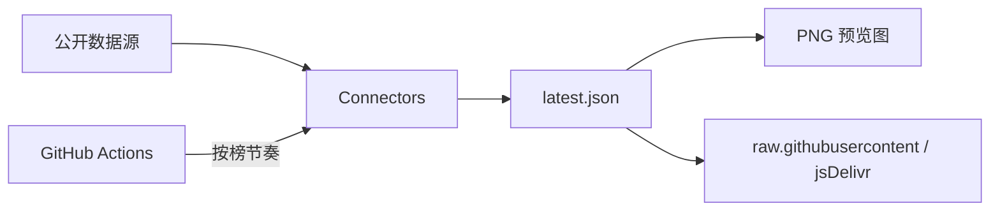

<div align="center">


# EveryLeaderboard

**客观、可量化的排行榜开放目录。**

[English](README.md) · [简体中文](README.zh-CN.md)

[](LICENSE)
[](catalogs/index.json)
[](schemas/)
[](https://github.com/chainepic/EveryLeaderboard/stargazers)

<br/>


</div>

---

> [!IMPORTANT]
> 只收**能量化、能核对来源**的榜单。编辑部主观梯队、S/A/B 观点榜不在范围内。

## 预览图

JSON 快照会渲染成可转发的 PNG（快照更新后由 Actions 重新出图）：

<div align="center">
  
  <p><sub>全球加密货币市值 Top 10 · 由 <code>boards/crypto-marketcap-top100/latest.json</code> 生成</sub></p>
</div>

本地重新出图：

```bash
python scripts/render_preview.py
```

## 这个项目解决什么

网上很多「排行」要么锁在付费研报里，要么散落在格式不一的博客表格里。这里把稳定的公开数据源收成：

| 你能拿到什么 | 路径 |
| --- | --- |
| 榜单目录 | [`catalogs/index.json`](catalogs/index.json) |
| 最新快照 | `boards/{slug}/latest.json` |
| 历史存档 | `boards/{slug}/history/` |
| 可传播预览图 | [`docs/assets/`](docs/assets/) |

## 特性

| | |
| --- | --- |
| 📊 **只做客观榜** | 指标带单位，能复算 |
| 🖼️ **自带传播图** | 快照 → PNG，方便分享 |
| ⏱️ **按榜定更新频率** | 小时 / 日 / 周 / 月 / 随源发布 |
| 🔌 **Connector 模型** | 一类数据源一套适配器 |
| 🧾 **留底** | `meta.json` 写清来源与方法 |
| 🌐 **零服务器 API** | raw.githubusercontent / jsDelivr |

## API（不用自建服务）

```bash
curl -sL https://raw.githubusercontent.com/chainepic/EveryLeaderboard/main/catalogs/index.json
curl -sL https://raw.githubusercontent.com/chainepic/EveryLeaderboard/main/boards/crypto-marketcap-top100/latest.json
```

CDN：

```text
https://cdn.jsdelivr.net/gh/chainepic/EveryLeaderboard@main/boards/{slug}/latest.json
```

## 榜单目录

| 榜单 | 更新节奏 | 状态 | 指标 |
| --- | --- | --- | --- |
| [crypto-marketcap-top100](boards/crypto-marketcap-top100/meta.json) | 每 6 小时 | experimental | market_cap_usd |
| [nba-standings](boards/nba-standings/meta.json) | 每日* | planned | win_pct |
| [soccer-pl-table](boards/soccer-pl-table/meta.json) | 每日* | planned | points |
| [soccer-ucl-table](boards/soccer-ucl-table/meta.json) | 每日* | planned | points |
| [steam-top-played](boards/steam-top-played/meta.json) | 每日 | planned | ccu |
| [github-trending-daily](boards/github-trending-daily/meta.json) | 每日 | planned | stars_period |
| [github-trending-weekly](boards/github-trending-weekly/meta.json) | 每周 | planned | stars_period |
| [hf-models-trending](boards/hf-models-trending/meta.json) | 每日 | planned | downloads |
| [npm-react-ecosystem](boards/npm-react-ecosystem/meta.json) | 每周 | planned | downloads_week |
| [pypi-top-tracked](boards/pypi-top-tracked/meta.json) | 每周 | planned | downloads_month |
| [wikipedia-pageviews-top](boards/wikipedia-pageviews-top/meta.json) | 每日 | planned | pageviews |
| [china-nev-brand-sales](boards/china-nev-brand-sales/meta.json) | 每月 | planned | units |
| [china-passenger-car-sales](boards/china-passenger-car-sales/meta.json) | 每月 | planned | units |
| [box-office-weekend-us](boards/box-office-weekend-us/meta.json) | 每周 | planned | revenue_usd |
| [imdb-top250](boards/imdb-top250/meta.json) | 每周 | planned | rating |

\* 受赛季月份限制（见各榜 `active_months`）。

## 本地跑起来

```bash
git clone https://github.com/chainepic/EveryLeaderboard.git
cd EveryLeaderboard
python3 -m pip install -r requirements.txt

python scripts/validate.py
python scripts/run_due.py --dry-run
python scripts/run_due.py --slug crypto-marketcap-top100 --force
python scripts/render_preview.py
```

## 目录结构

```text
boards/<slug>/latest.json    # 数据
docs/assets/*.png            # 可分享预览图
scripts/render_preview.py    # JSON → PNG
scripts/run_due.py           # 按榜调度
connectors/                  # 数据源适配器
```



## 参与贡献

提 Issue 时请写清：slug、指标与单位、数据源 URL、更新节奏。  
主观榜、无法核对的「人气榜」不会收录。

## 许可证

- **代码**：[MIT](LICENSE)
- **数据**：以各榜 `meta.json` 声明为准，并遵守上游条款

---

<div align="center">
<sub><a href="README.md">English</a> · 简体中文</sub>
</div>
